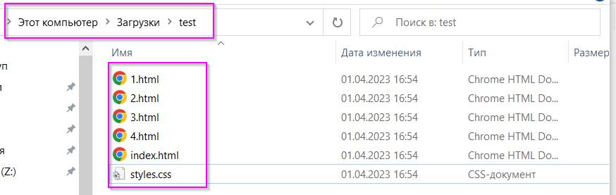
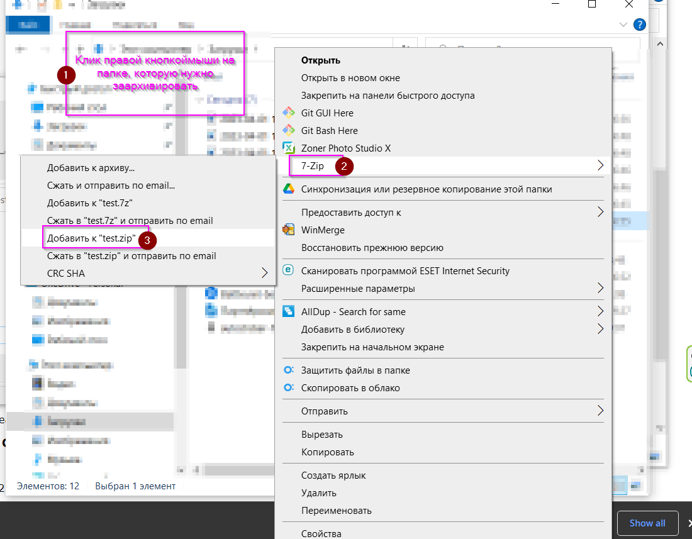

# Как сделать архив из нескольких файлов на примере архиватора 7-zip. К моменту начала действий этой инструкции архиватор должен быть уже установлен. _[Как установить архиватор 7-zip?](/Install%207z/readme.md)_
## Шаг 1

1. Подготовить все необходимые файлы для будущего архива и собрать их в одной папке.
2. На скриншоте - это папка "test"

## Шаг 2

1. Выходим из подготовленной папки в родительскую папку (на 1 уровень вверх)
2. Нажимаем правой кнопкой мыши на подготовленной папке
3. В меню выбираем 7-zip
4. В дополнительном меню выбираем добавить к "<имя папки>.zip"
5. Подтверждаем выбор нажатием левой кнопки мыши.
6. В папке где мы нажимали правую кнопку мыши (пункт 2) появится новый файл. ("<имя папки>.zip")
7. Полученный файл и является архивом, который нам необходимо сделать.

