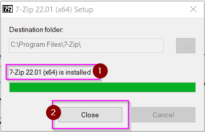
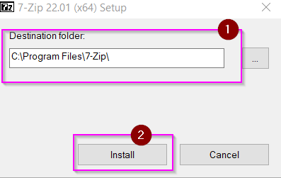
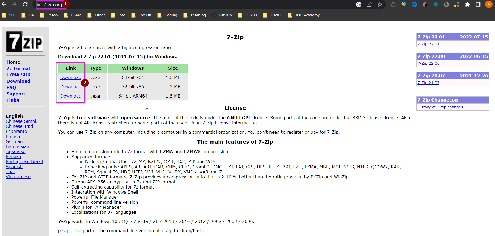

# Как установить 7Z архиватор.
## Шаг 1

1. Заходим на сайт [7-zip.org](https://www.7-zip.org/)
2. Выбираем версию установщика для закачки.
3. Выкачиваем установщик себе на компьютер.

## Шаг 2

1. Запускаем скаченный файл.
2. При запросе системы о правах, соглашаемся с запуском.

## Шаг 3

1. Выбираем папку для установки архиватора (если нет уверености, какая должна быть, лучше оставить предложенную автоматически)
2. Нажимаем кнопку "Установить".

## Шаг 4

1. Как только установка будет завершена установщик сообщит об этом.
2. Нажимаем кнопку "Закрыть".

